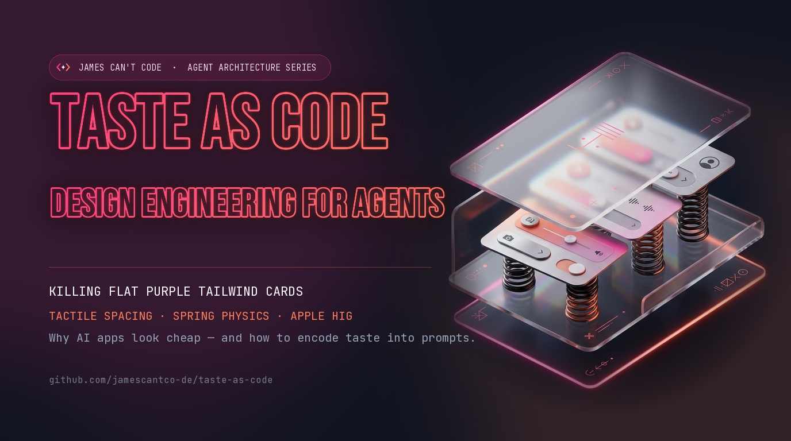

<p align="center">
  
</p>

# Taste as Code: The Open Design Library by James Can't Code (@JamesCantCode)

> **1,300+ production-grade `DESIGN.md` specs, tactile micro-spacing rules, spring physics presets, and component tokens for AI coding agents (Antigravity, Claude Code, Cursor) and human builders.**  
> Curated by **James Can't Code** ([jamescantco.de](https://jamescantco.de) | [@JamesCantCode](https://x.com/JamesCantCode)).
> GitHub: [github.com/jamescantco-de/taste-as-code](https://github.com/jamescantco-de/taste-as-code)

---

## The Philosophy: Why "Taste as Code"?

AI coding agents have infinite stamina, but zero aesthetic instinct.

If you prompt an LLM with *"build a clean, modern landing page"*, it reaches for the statistical mean of its training data: generic purple gradients, floating borderless cards, unstyled focus states, and linear CSS transitions that feel like PowerPoint 2003.

**Taste cannot be requested as an adjective. Taste must be encoded as deterministic constraints.**

The **Open Design Library** is a curated, open-source archive aggregated from exceptional designers, design engineers, and public sources across the internet. Instead of hoping an agent guesses your visual preferences, you drop a `DESIGN.md` into your repository root or inject specific tokens into your prompt. The agent instantly adheres to strict typography hierarchies, cohesive palettes, 44px touch targets, and physical spring inertia.

---

## What’s Inside

### 1. 1,340+ Production Design System Specs (`/styles`)
Complete, machine-readable `DESIGN.md` specs extracted and indexed from leading software products, studios, and apps across the web:
- **Product Archetypes**: Linear, Apple, Stripe, Raycast, Vercel, Supabase, Arc, GitHub, Airbnb, Notion, etc.
- **Each file specifies**: Exact color tokens (60-30-10 distribution), typography scales (tracking, leading, optical weights), elevation/shadows, border-radii, and spacing tokens.
- **Searchable Index**: Browse [INDEX.md](INDEX.md) or use `python3 search.py "<keyword>"` to find styles by theme (e.g. `dark mode`, `minimal`, `editorial`, `glassmorphism`, `fintech`).

### 2. Physical Animation & Spring Tokens (`/assets/blueprints` & `/assets/kinetics`)
- **Physics Over Easing**: Standardized spring presets (Stiffness, Damping, Mass) replacing floaty `ease-in-out` transitions.
- **Active State Physics**: The 44px touch target rule, optical balance (`text-wrap: balance`), and hardware-like micro-compression (`active:scale-[0.98]`).
- **Liquid Glass Optical Shaders**: CSS/WebGL specifications for Apple-style physical refraction and translucent materials.

### 3. Kinetic Typography & Component Blueprints (`/assets`)
- **Circle Loaders** (`/assets/circle-loaders`): 25 bespoke SVG loader animations + reusable React component (`CircleLoader.tsx`).
- **Gradient Buttons** (`/assets/gradient-buttons`): Curated interactive button states with high-contrast active feedback.
- **Text Effects & Kinetics** (`/assets/text-effects`, `/assets/kinetics`): Physics-based entrance/exit choreography.
- **Section Blueprints** (`/assets/blueprints`): Production layouts for hero docks, bento grids, and high-converting feature cards.

---

## How to Use With AI Agents

### Option 1: Drop-in Project Design Spec
Copy any archetype to your project root as `DESIGN.md`:
```bash
# Example: Apply Linear's design system to your workspace
cp styles/linear.md ./DESIGN.md
```
Then prompt your agent:
> *"Adhere strictly to the design tokens, typography scale, and color rules defined in DESIGN.md."*

### Option 2: CLI Search Helper
Search for styles matching any industry, vibe, or aesthetic:
```bash
python3 search.py "dark fintech"
python3 search.py "minimal editorial"
```

### Option 3: Direct Prompt Injection
Reference specific spring tokens in your prompt:
```typescript
// Standardized Spring Tokens
export const springs = {
  snappy: { type: 'spring', stiffness: 400, damping: 28, mass: 0.8 }, // Buttons, toggles
  smooth: { type: 'spring', stiffness: 260, damping: 26, mass: 1 },   // Drawers, modals
  gentle: { type: 'spring', stiffness: 180, damping: 24, mass: 1.2 }  // Page transitions
};
```

---

## Open Attribution & Community Sources

This library is a tribute to the craftsmanship of designers and design engineers across the open web. It brings together patterns, specifications, and inspirations from:

- **[styles.refero.design](https://styles.refero.design/)** & **Refero Design**: The primary catalog source for product design system breakdowns.
- **Apple Human Interface Guidelines (HIG)**: Spatial consistency, fluid spring dynamics, and touch ergonomics.
- **Sam Asante** ([glass.samasante.com](https://glass.samasante.com)): Optical Liquid Glass shaders and tactile depth.
- **Dominika Kissi** ([circleloaders.dominikakissi.com](https://circleloaders.dominikakissi.com)): Circle loaders and geometric SVG motion.
- **Colorion Kinetics & Gradients** ([kinetics.colorion.co](https://kinetics.colorion.co)): Kinetic typography and interactive gradients.
- **Minimal Gallery, Kage Design, 21st.dev, & UI Galleries**: Visual references for modern web layout balance.

All trademarks, brand assets, and original product styles belong to their respective creators and companies. This repository serves as an educational and design-engineering research resource for developers and AI agents striving to build higher-quality software.

---

## License

MIT License — free for personal, commercial, and agentic workflows. Star, fork, and contribute!
